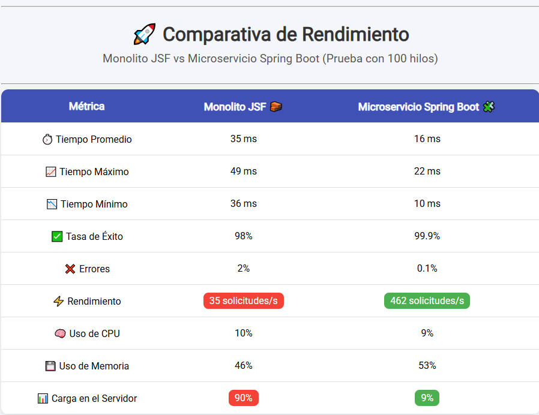
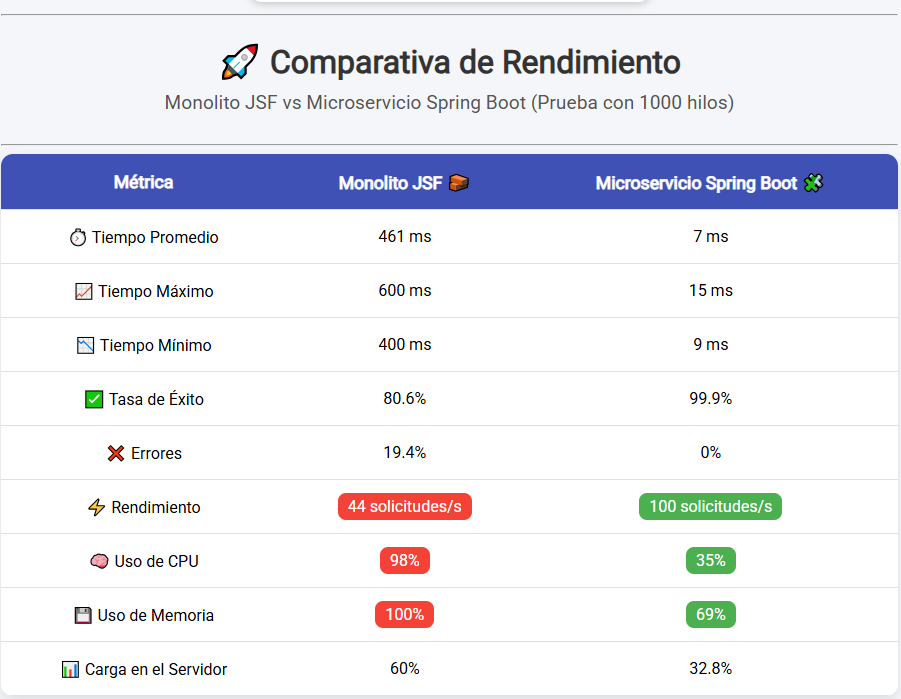

⚔️ Comparativa de Rendimiento: JSF en IDE vs Spring Boot en Docker
Este repositorio contiene los resultados y configuraciones utilizadas para evaluar el rendimiento de una arquitectura Monolítica (JSF) frente a una arquitectura de Microservicios (Spring Boot) bajo diferentes cargas concurrentes (100 y 1000 hilos).

🔗 Ver presentación visual: [Google Site del Proyecto](https://sites.google.com/view/jsfspring/inicio)

📌 Objetivo
Analizar la escalabilidad y eficiencia entre JSF y Spring Boot en un entorno clúster, mediante pruebas de estrés con JMeter.

🔧 Estructura del Repositorio
pruebas/ : Archivos .jmx para JMeter.

docs/ : Documentación adicional, configuracion Bases de datos y análisis de resultados y tutrial de configuracion para Jmeter.

docker/ : Archivos Dockerfile, docker-compose.yml y nginx.conf para levantar el entorno Spring Boot + PostgreSQL + Nginx.

## 🧪 Pruebas realizadas

| Hilos | JSF (req/s) | Spring Boot (req/s) |
|-------|-------------|---------------------|
| 100   | 44          | 101                 |
| 1000  | 35          | 462                 |

## 📊 Recursos usados
- Apache JMeter
- Chart.js + ChartDataLabels
- HTML + CSS básico

- ## 📈 Gráficas comparativas

### 100 hilos

### 1000 hilos

- 
🐳 Dockerización del Proyecto Spring Boot
1. Estructura Docker
El proyecto cuenta con un entorno completo de contenedores:

PostgreSQL como base de datos.

Dos instancias de la app Spring Boot (spring1, spring2).

Volumen de PostgreSQL:
El old_pgdata está externo y apunta a una carpeta/volume ya creado.
Si otra persona quiere levantar el proyecto, quizás tenga que crear su propio volumen. Podrías agregar una nota como:

Si el volumen `old_pgdata` no existe en su sistema, pueden comentarlo o reemplazarlo por:
volumes:
  - pgdata:/var/lib/postgresql/data

y en `volumes:` definir:

volumes:
  pgdata:
(así queda autogestionado en el docker-compose).

Nginx como balanceador de carga.

El balanceo se realiza en modo round-robin sobre las instancias de Spring Boot para simular alta disponibilidad y escalabilidad horizontal.

3. Nginx.conf
También estaría bueno que subas el archivo nginx.conf a tu repo.
Ejemplo de contenido que deberías tener:

nginx
events { }

http {
    upstream spring_backend {
        server spring1:8080;
        server spring2:8080;
    }

    server {
        listen 80;

        location / {
            proxy_pass http://spring_backend;
        }
    }
}
✅ Esto conecta nginx al "cluster" de spring1 y spring2 y balancea las peticiones.

2. Archivos incluidos
Dockerfile → Construye la imagen de la app Spring Boot.
docker-compose.yml → Levanta todos los servicios necesarios.
nginx.conf → Configura Nginx para balancear entre spring1 y spring2.

3. Instrucciones de Uso
Compilar el proyecto Spring Boot:

mvn clean package
Levantar el entorno completo:

docker-compose up --build
Acceder a la aplicación:

La app estará disponible en: http://localhost:8080

4. Variables de Entorno
La app Spring Boot utiliza las siguientes variables para la conexión a PostgreSQL:

SPRING_DATASOURCE_URL

SPRING_DATASOURCE_USERNAME

SPRING_DATASOURCE_PASSWORD

Estas variables están configuradas en el archivo docker-compose.yml.

🧪 Pruebas Realizadas

| Hilos | JSF (req/s) | Spring Boot (req/s) |
|-------|-------------|---------------------|
| 100   | 44          | 101                 |
| 1000  | 35          | 462                 |

📊 Recursos Utilizados
Apache JMeter (para pruebas de estrés)

Chart.js + ChartDataLabels (para visualización de datos)

HTML + CSS básico (para mostrar gráficos)

Google Sites (presentación visual)

📈 Gráficas Comparativas
100 hilos
📈 Comparativa rendimiento entre JSF y Spring Boot con 100 hilos.

1000 hilos
📈 Comparativa rendimiento entre JSF y Spring Boot con 1000 hilos.

🔌 Conexión a la Base de Datos
Las instrucciones detalladas para la conexión a bases de datos están disponibles en:

docs/conexion-jsf-mysql.txt → Conexión de JSF a MySQL.

docs/conexion-spring-postgresql.txt → Conexión de Spring Boot a PostgreSQL.

✅ Conclusión
Spring Boot, desplegado en un entorno dockerizado y balanceado, demostró mayor escalabilidad y eficiencia bajo carga alta, con un consumo optimizado de recursos y mayor rendimiento por segundo en comparación con la arquitectura monolítica de JSF.

🙌 ¡Gracias por visitar este repositorio!
Cualquier ⭐ estrella o feedback será bienvenido.
¡Seguimos mejorando juntos! 🚀

